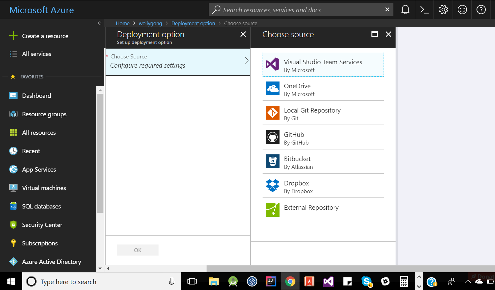

# Motion Sensor and Web App demo

## 0) Fork and clone, or download this repo
Cloning 
```
cd to/your/destination/folder
git clone https://github.com/potatowagon/silly-app-demo.git 
```
Add remote 

```
git remote add origin https://github.com/<your-github-username>/silly-app-demo.git
```
copy your link from github's green clone button

## 1) Adjust Chrome flags
Android Chrome disables motion sensors and audio play from custom event triggers by default (Since chrome version 63). Enable them for your app to work.

In Chrome search bar go to 
```
about:flags
```
Search for `Generic Sensor` and change to Enabled. </br>
Search for `Autoplay policy` and change to No user gesture is required.


## 2) Code Snippets

### HTML Button
Let's add a button! </br>
Paste this code under /\*INSERT HTML BUTTON HERE\*/ in index.html

```
<button type="button" onclick="scream()">Tickle!</button>
```

### Make Button scream
Clicking on the button, scream() function is called. Lets define it. </br>

Paste this under /\* INSERT SCREAM FOR BUTTON CLICK FUNCTION HERE\*/ in index.js

```
function scream() {
    var scream = new Audio(randomPicker(app.audio));
    scream.play();
}
```

### Linear Acceleration Sensor
This is your accelerometer. This detects linear acceration without counting in gravity. </br>

Paste this code snippet under /\*INSERT ACCELEROMETER HERE\*/ in index.js

```
try {
    let sensor = new LinearAccelerationSensor({ frequency: 60 });
    sensor.start();

    sensor.onreading = () => {
        var event = new CustomEvent('devicemotion', {
            detail: {
                acceleration: {
                    x: sensor.x,
                    y: sensor.y,
                    z: sensor.z
                }
            }
        });
        window.dispatchEvent(event);
    }
    sensor.onerror = event => console.log(event.error.name, event.error.message);
}
catch (e) {
    console.log(e);
    app.usingGenericSensor = false;
}
```

<a href="https://developers.google.com/web/updates/2017/09/sensors-for-the-web">More info on motion sensors</a> 

### ADD AN EVENT LISTENER TO WINDOW

So window (your open chrome window) will catch the `devicemotion Event` thrown by sensor. </br>

Paste this under /\*ADD AN EVENT LISTENER TO WINDOW\*/ in index.js

```
window.addEventListener('devicemotion', deviceMotionHandler, false);
```

### Make app scream

Paste this code snippet under /\*DO SILLY STUFF\*/ in index.js

```
var scream = new Audio(randomPicker(app.audio));
scream.play();
sleep(2000);
```

## 3) Stage, Commit, Push
ONLY FOR GIT USERS </br>

Stage
```
git add --all
```

Commit
```
git commit -m "your message"
```

Push your local changes to Github
```
git push origin master:master
```

## 4) Deploy to Azure

Dashboard > your-app > deployment options 
</br>

Configure either dropbox or Github




<a href="https://blogs.msdn.microsoft.com/africaapps/2013/06/11/deploying-windows-azure-websites-using-dropbox/">How to dropbox</a>

